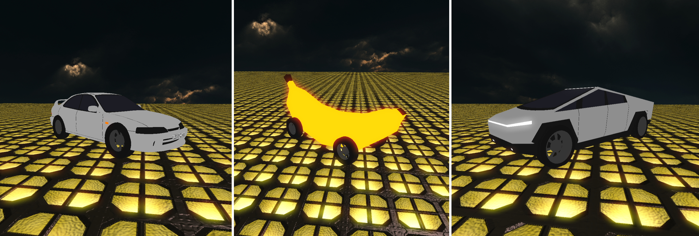

# DrivableVehicles

Local-only drivable vehicles for **CastleForge / CastleMiner Z**.

DrivableVehicles is a vehicle mod that supports selectable XNB vehicle models, per-vehicle handling configs, optional WAV sounds, clean driving HUD behavior, and hot-reloadable settings.

> **Status:** Prototype / local-only.  
> This mod currently focuses on getting vehicles spawned, selected, rendered, and driven locally. Crafting, save/load persistence, proper block collision, and multiplayer sync are not implemented yet.

> **Texture note:** The included example vehicle XNBs are currently model-only and do not have finished textures yet. They are included as working examples for testing model loading, controls, sounds, and per-vehicle configs.



<p align="center">
  
  
</p>

---

## Contents

- [Version 0.1.20 concise command summaries](#version-0120-concise-command-summaries)
- [Install layout](#install-layout)
- [Vehicle model conversion](#vehicle-model-conversion)
  - [Export from Unity](#1-export-from-unity)
  - [Clean in Blender](#2-clean-in-blender)
  - [Convert FBX to XNB](#3-convert-fbx-to-xnb)
  - [Place converted files](#4-place-converted-files)
  - [Select in game](#5-select-in-game)
- [Commands](#commands)
- [Driving controls](#driving-controls)
- [Master config](#master-config)
  - [Optional feedback](#optional-feedback)
- [Per-vehicle config](#per-vehicle-config)
- [Sound behavior](#sound-behavior)
- [Model tuning](#model-tuning)
  - [Scale](#scale)
  - [Yaw offset](#yaw-offset)
  - [Z offset](#z-offset)
  - [Wheel clone workaround](#wheel-clone-workaround)
- [Alpha Prototype model](#alpha-prototype-model)
- [Troubleshooting](#troubleshooting)
- [Development notes](#development-notes)
- [Credits / license](#credits--license)

---

## Version 0.1.20 concise command summaries

This build keeps the working driving/input behavior, selectable model folders, XNB model loading, missing-wheel cloning, automatic clean HUD, held-item action blocking, optional sounds, config reloads, and concise model-selection feedback.

New in 0.1.20:

- `/vehicle help` now prints a shorter workflow-style summary instead of a long command-by-command list.
- HelpRegistry descriptions now use concise categories: Flow, Models, Tuning, HUD, Audio, Config, Alias, and Help.
- Added small XML summaries to the command helper methods in `DrivableVehicles.cs`.

Still included from earlier builds:

- `/veh` shortcut alias for `/vehicle`.
- Selectable vehicle model folders.
- Model names with spaces, such as `/veh model tofu machine`.
- Per-vehicle `models` subfolders, such as `Models\Truck\models\Truck.xnb`.
- Per-vehicle `vehicle.clag` files.
- Master `DrivableVehicles.clag` for default keybinds and feedback settings.
- Optional loose `.wav` sounds for enter, accelerate, decelerate, and skid/drift.
- Per-vehicle top speed, acceleration, braking, drag, and steering.
- Hot reload with `Ctrl+Shift+R` by default.
- Automatic clean HUD while driving.
- Held-item action blocking while driving.
- Missing-wheel clone workaround for converted models that only import one wheel mesh.
- Optional routine feedback suppression with `[Feedback] VehicleState=false`.
- Concise model selection feedback with refresh count.

---

## Install layout

Recommended folder layout:

```text
CastleMiner Z
└── !Mods
    └── DrivableVehicles
        │   DrivableVehicles.clag
        │   vehicle.clag.example
        │
        └── Models
            ├── Truck
            │   │   Truck.png
            │   │   vehicle.clag
            │   │
            │   ├── models
            │   │       Truck.xnb
            │   │
            │   └── sounds
            │           unlock.wav
            │           accel_truck.wav
            │           deaccelerate.wav
            │           tire_skidding.wav
            │
            └── tofu machine
                │   tofu machine.png
                │   vehicle.clag
                │
                ├── models
                │       tofu machine.xnb
                │       tofu_shop_0.xnb
                │       fposter,small,wall_texture,produ_0.xnb
                │
                └── sounds
                        unlock.wav
                        accel_nico.wav
                        deaccelerate.wav
                        tire_skidding.wav
```

The currently preferred model layout is:

```text
!Mods\DrivableVehicles\Models\<VehicleName>\models\<VehicleName>.xnb
```

The older flat layout is still supported:

```text
!Mods\DrivableVehicles\Models\<VehicleName>\<VehicleName>.xnb
```

If the converter creates sidecar texture XNBs, keep them beside the main model XNB in the same `models` folder.

---

## Vehicle model conversion

CastleMiner Z uses XNA `.xnb` content. Unity prefabs, Unity `.asset` mesh files, Blender files, and FBX files cannot be loaded directly by the game.

> **Texture status:** The bundled example XNBs do not currently include finished textures. If your conversion outputs texture dependency `.xnb` files, keep them beside the main model `.xnb` in the same `models` folder.

Recommended conversion flow:

```text
Unity prefab / Unity mesh source
→ FBX export
→ optional Blender cleanup
→ FBX export from Blender
→ FbxToXnb converter
→ .xnb files placed under !Mods\DrivableVehicles\Models\<Vehicle>\models
```

### 1. Export from Unity

Open the original Unity project and export one vehicle prefab at a time.

Example:

```text
Assets\Vehicles\Prefabs\Truck.prefab
→ Truck.fbx
```

For the first pass, export the full vehicle hierarchy. Later, wheels can be split or adjusted if needed.

### 2. Clean in Blender

In Blender, check:

```text
- The vehicle is visible.
- The vehicle is facing a known direction.
- The origin/pivot is near the center-bottom of the vehicle.
- The scale is reasonable.
- Wheel objects are real mesh objects, not unresolved Unity-style instances.
```

Useful Blender cleanup operations:

```text
Object > Relations > Make Single User > Object & Data
Object > Apply > All Transforms
Object > Apply > Visual Transform
Object > Make Instances Real
```

For debugging, a single joined static mesh can be useful:

```text
Select body + wheels
Ctrl+J
Apply transforms
Export FBX
Convert to XNB
```

That is not ideal for spinning wheels later, but it is a good way to prove the full model renders.

### 3. Convert FBX to XNB

Use the CastleForge FBX-to-XNB converter.

Recommended converter mode for these Unity-exported vehicles:

```text
--fbxComp 0
```

Example output:

```text
Truck.xnb
```

Some models may also output texture dependency XNB files. Keep those in the same folder as the main model.

### 4. Place converted files

Example:

```text
!Mods\DrivableVehicles\Models\Truck\models\Truck.xnb
```

If there are sidecar texture XNBs:

```text
!Mods\DrivableVehicles\Models\Truck\models\Truck.xnb
!Mods\DrivableVehicles\Models\Truck\models\SomeTexture.xnb
!Mods\DrivableVehicles\Models\Truck\models\AnotherTexture.xnb
```

### 5. Select in game

```text
/veh model Truck
/veh clear
/veh spawn
```

For model names with spaces:

```text
/veh model tofu machine
```

---

## Commands

`/vehicle help` summarizes commands by workflow:

```text
Flow: /veh spawn, /veh enter, /veh exit, /veh clear.
Models: /veh models, /veh model <name>, /veh modeldiag.
Tuning: /veh scale 10, /veh yawoffset 90, /veh zoffset 0.5, /veh wheelclone on.
HUD/audio: clean HUD auto-enables while driving; /veh cleanhud and /veh sounds are available.
Config: /veh config, /veh reload, or Ctrl+Shift+R hot-reload configs and sounds.
Defaults: W/S throttle/reverse, A/D steer, Space brake, R enter/exit.
```

Shortcut examples:

```text
/veh spawn
/veh model Truck
/veh model tofu machine
/veh reload
```

### Common commands

| Command | Summary |
| -------------------------- | -------------------------------------------------------- |
| `/veh spawn`               | Spawn and enter a vehicle.                               |
| `/veh enter`               | Enter the nearest spawned vehicle.                       |
| `/veh exit`                | Exit the current vehicle.                                |
| `/veh clear`               | Remove spawned prototype vehicles.                       |
| `/veh models`              | List selectable model folders.                           |
| `/veh model`               | Show selected model and load status.                     |
| `/veh model <name>`        | Select a model folder under `Models`.                    |
| `/veh modeldiag`           | Write model mesh/bone diagnostics to `modeldiag.txt`.    |
| `/veh scale <number>`      | Set visual model scale.                                  |
| `/veh yawoffset <degrees>` | Rotate the visual model.                                 |
| `/veh zoffset <number>`    | Move the visual model up/down. Blender Z maps to game Y. |
| `/veh wheelclone on/off`   | Clone the imported wheel mesh onto missing wheel bones.  |
| `/veh cleanhud`            | Toggle manual clean HUD. Auto-enables while driving.     |
| `/veh sounds`              | Show optional WAV sound load status.                     |
| `/veh config`              | Show config and active model paths.                      |
| `/veh reload`              | Hot-reload configs and sounds.                           |

---

## Driving controls

Default keys:

```text
W       forward / throttle
S       reverse
A       steer left
D       steer right
Space   brake
R       enter / exit vehicle
Esc     normal menu
Chat    normal chat behavior
```

Held-item actions are blocked while driving, so the player should not mine, shoot, place blocks, melee, throw grenades, or continue crack-box mining while inside a vehicle.

---

## Master config

On first load, the mod writes:

```text
!Mods\DrivableVehicles\DrivableVehicles.clag
```

Default contents:

```ini
[Keys]
Enter=R
Exit=R
Forward=W
Left=A
Right=D
Reverse=S
Brake=Space
Reload=R
ReloadRequiresCtrl=true
ReloadRequiresShift=true
ReloadRequiresAlt=false

[Feedback]
VehicleState=true
```

Change the keys, then reload in game with:

```text
Ctrl+Shift+R
```

or:

```text
/vehicle reload
```

### Optional feedback

Routine vehicle-state messages can be hidden in the master config:

```ini
[Feedback]
VehicleState=false
```

This hides routine messages such as spawned, entered, exited, and cleared. Errors and explicit command output such as `/vehicle model`, `/vehicle config`, `/vehicle sounds`, and `/vehicle modeldiag` still show.

---

## Per-vehicle config

On first load, the mod writes a template:

```text
!Mods\DrivableVehicles\vehicle.clag.example
```

Copy it into a model folder as:

```text
!Mods\DrivableVehicles\Models\Truck\vehicle.clag
```

Example:

```ini
[Vehicle]
MaxForwardSpeed=18
MaxReverseSpeed=-7
Acceleration=18
BrakeStrength=10
Drag=3.5
SteerRate=2.35

[Sounds]
Enabled=true
Volume=0.75
Enter=sounds\unlock.wav
Accelerate=sounds\accel.wav
Decelerate=sounds\deaccelerate.wav
Skid=sounds\tire_skidding.wav
```

Sound paths are resolved relative to the vehicle folder first.

Example:

```text
!Mods\DrivableVehicles\Models\Truck\sounds\unlock.wav
```

If not found there, the mod also checks paths relative to:

```text
!Mods\DrivableVehicles
```

The mod does not create a shared top-level `Sounds` folder automatically. You can still create one yourself and reference it from a config if you want shared sounds.

Missing sound files are skipped. They do not stop the vehicle from loading or driving.

---

## Sound behavior

Supported optional WAV sounds:

```text
Enter        played when entering a vehicle
Accelerate   looped/played while accelerating
Decelerate   looped/played while decelerating/reversing
Skid         looped/played while drifting/skidding
```

The skid sound triggers while all of these are true:

```text
Brake + Forward + Left or Right + moving
```

With default keys:

```text
Space + W + A/D
```

---

## Model tuning

Some converted models need visual tuning. These settings are runtime-only debug commands unless saved into future config support.

Common CyberTruck/Unity-export tuning:

```text
/veh scale 10
/veh yawoffset 90
/veh zoffset 0.5
/veh wheelclone on
```

### Scale

```text
/veh scale 10
```

Changes the visual size of the loaded model.

### Yaw offset

```text
/veh yawoffset 90
```

Rotates the visual model if it faces sideways or backward.

### Z offset

```text
/veh zoffset 0.5
```

Moves the visual model up/down. Blender Z maps to CastleMiner Z world Y.

### Wheel clone workaround

```text
/veh wheelclone on
```

Some converted vehicle XNBs import one visible wheel mesh but keep bones for all wheel positions. The wheel clone workaround reuses the imported wheel mesh at the missing wheel bone locations.

Use diagnostics to verify what the XNB contains:

```text
/veh modeldiag
```

This writes:

```text
!Mods\DrivableVehicles\modeldiag.txt
```

---

## Alpha Prototype model

The original procedural blue placeholder car is still available.

```text
/veh model Alpha Prototype
```

Aliases:

```text
/veh model prototype
/veh model alpha
/veh model placeholder
/veh model original prototype
/veh model box car
```

Real XNB folders take priority over aliases. For example, if this exists:

```text
!Mods\DrivableVehicles\Models\prototype\models\prototype.xnb
```

then:

```text
/veh model prototype
```

loads the XNB model instead of the built-in placeholder.

---

## Troubleshooting

### `/veh model <name>` says the model was not found

Check that the folder and XNB names match:

```text
!Mods\DrivableVehicles\Models\Truck\models\Truck.xnb
```

For names with spaces:

```text
!Mods\DrivableVehicles\Models\tofu machine\models\tofu machine.xnb
```

### Only one wheel appears

Run:

```text
/veh modeldiag
```

If the diagnostics show one imported wheel mesh and several wheel bones, try:

```text
/veh wheelclone on
```

For a better long-term fix, re-export from Blender after making wheel objects real/single-user mesh objects.

### Model is too low or too high

Try:

```text
/veh zoffset 0.5
```

### Model is too small or too large

Try:

```text
/veh scale 10
```

### Model faces the wrong direction

Try:

```text
/veh yawoffset 90
/veh yawoffset 180
/veh yawoffset 0
```

### Config changes did not apply

Reload with:

```text
/veh reload
```

or press the hot reload chord:

```text
Ctrl+Shift+R
```

---

## Development notes

This is still a local-only prototype. It does not yet add:

```text
crafting
save/load persistence
proper block collision
damage/destruction
multiplayer sync
server authority
wheel spin animation
vehicle inventory
fuel
```

The current goal is to keep the mod small, readable, and easy to build on.

---

## Credits / license

Author: RussDev7
Source repo: https://github.com/RussDev7/CastleForge-DrivableVehicles
Release page: https://github.com/RussDev7/CastleForge-DrivableVehicles/releases
License: GPL-3.0 license

### Vehicle assets and sounds

Vehicle assets and sounds are from:

https://github.com/sodiboo/Muck

Additional conversion, CastleForge integration, model loading, vehicle controls, configuration support, and CastleMiner Z mod implementation are part of CastleForge-DrivableVehicles.